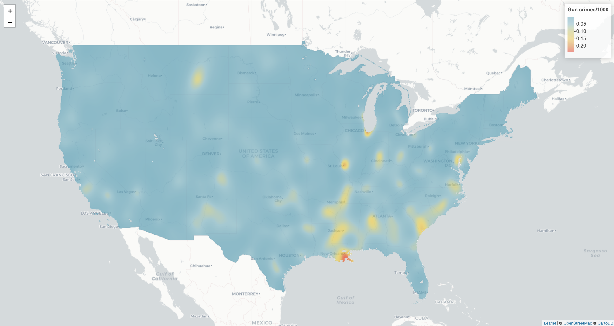
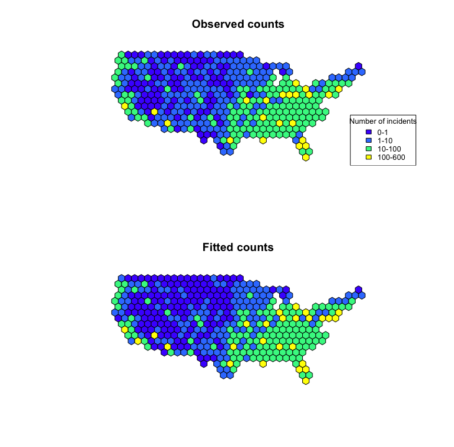

## Fitting point process models to disease case data with MGCV (or whatever you want)
We are going to fit a point process model using Generalized Additive Modeling via the MGCV package. 

First let's load the gun crime data for the USA in 2015 and corresponding population raster (WorldPop) from the DiSARM package


```r
library(DiSARM)
library(raster)
library(mgcv)
library(wesanderson)
library(leaflet)
library(MapPalettes)
library(sf)
library(ggplot2)
data('gun_crime_USA_2015')
data('USA_pop_2015')
```

We can generate a map of these incidents
```r
quick_map(gun_crime_sf, 'num_killed')
```

<!-- -->

For simplicity, let's just work with the 48 contiguous states
```r
# Get USA data
states <- raster::getData("GADM", country="USA", level=1)
states_49 <- subset(states, !(NAME_1 %in% c("Alaska", "Hawaii")))
USA_pop_2015 <- crop(USA_pop_2015, states_49)
```

Now, to coin a phrase from Nick Golding's ppmify package, let's ppmify our data using `DiSARM::space_time_ppmify` to get it ready for modeling. 
```r
ppm_df <- space_time_ppmify(points = gun_crime_sf,
                exposure = USA_pop_2015,
                resolution=5,
                date_start_end=c("2015-01-01", "2015-12-31"),
                num_periods=1,
                approx_num_int_points = 10000,
                prediction_frame=TRUE)
```

Now let's fit a model using MGCV using a spatial-only model
```r
ppm_df$ppm_df <- subset(ppm_df$ppm_df, exposure!=0)
gam_mod <- mgcv::gam(outcome ~ s(x, y, k=500),
               offset=log(exposure),
               weights = regression_weights,
               data = ppm_df$ppm_df,
               method = "REML",
               family = "poisson")
```

Predict 
```r
pred_df_1 <- ppm_df$ppm_df_pred

# Resample population to the resolution specified in `space_time_ppmify`
reference_raster <- raster(extent(USA_pop_2015), res = 5/111)
exposure_resamp <- resample(USA_pop_2015, reference_raster)
exposure_resamp[which(exposure_resamp[]<0)] <- 0
mult_factor <- cellStats(USA_pop_2015, sum) / cellStats(exposure_resamp, sum)
exposure_resamp <- exposure_resamp * mult_factor

# Predict
predictions <- predict(gam_mod, pred_df_1)
predicted_num <- exp(predictions + log(exposure_resamp[!is.na(exposure_resamp[])]))

# Check predicted numbers against observed
sum(predicted_num)
nrow(gun_crime_sf)
```

    ## [1] 11597.09
    ## [1] 11609

Map predicted rate
```r
pred_raster <- cases_raster <- exposure_resamp
pred_raster[!is.na(exposure_resamp[])] <- predictions
cases_raster[!is.na(exposure_resamp[])] <- predicted_num

crs(pred_raster) <- crs(states_49)
pred_raster_inc <- exp(mask(pred_raster, states_49))*1000
quick_map(pred_raster_inc, raster_legend_title="Gun crimes/1000")
```
<!-- -->

Using the MapPalettes package we can compare predicted versus observed counts using hexbins
```r
hexbin_stats <- hexbin_raster(cases_raster, 500, function(x){sum(x,na.rm=T)})
intersects <- st_intersects(gun_crime_sf, st_as_sf(hexbin_stats))
intersects_table <- table(unlist(intersects))
hexbin_stats$observed <- 0
hexbin_stats$observed[as.numeric(names(intersects_table))] <- intersects_table

# Generate scatter plot
plot(hexbin_stats$observed, hexbin_stats$stat)
ggplot() + geom_point(aes(hexbin_stats$observed, hexbin_stats$stat)) +
scale_x_continuous(name="Observed numbers of incidents") + 
  scale_y_continuous(name="Predicted (fitted) numbers of incidents")
```
<!-- -->
```r
# And map
case_num_pal <- colorBin(topo.colors(5), c(0,600), bins = c(0, 1, 10, 100, 600))
par(mfrow=c(2,1))
plot(hexbin_stats, col = case_num_pal(hexbin_stats$observed), main = "Observed counts")
legend("bottomright", inset=0, title="Number of incidents",
   c("0-1","1-10","10-100", "100-600"), fill=case_num_pal(c(0.5, 1.5, 10.5, 100.5)), horiz=FALSE, cex=0.8)
plot(hexbin_stats, col = case_num_pal(hexbin_stats$stat), main = "Fitted counts")
```
<!-- -->